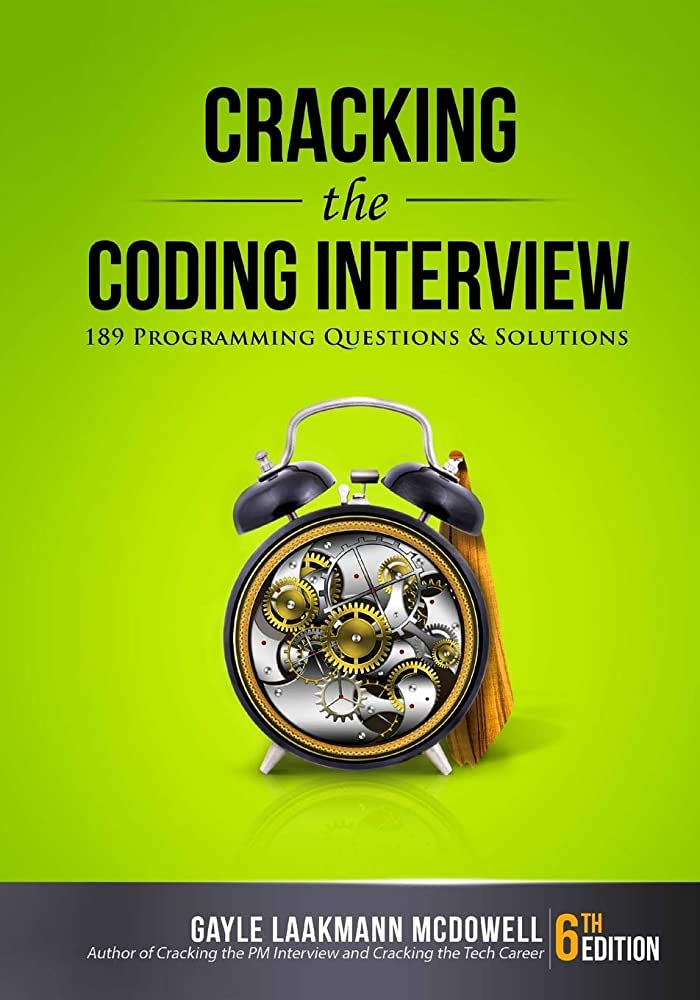

# Algorithms and Data Structures Study

> Note: This repository contains notes and code for the Algorithms and Data Structure Preparation. 

### Book we use for this study: 

- [Cracking the Coding Interview - Amazon](https://www.amazon.com/Cracking-Coding-Interview-Programming-Questions/dp/0984782850/ref=sr_1_1?dchild=1&keywords=cracking+the+coding+interview&qid=1627660003&sr=8-1)

## 📖  Table of Contents

### 1. Big O Notation
- [Big O Notation](#contents/big_O/big_O.md)
- [Technical Interviews](#contents/technical_interviews/technical_interviews.md)

## 📝 License  

This repository  is under [MIT](#LICENSE) License.

## 👨‍💻 Contributors 

- [Sardor](https://github.com/Sardor-M)
- [Bakhtee](https://github.com/Bahtiyorjon1997)
- [Firdavs](https://github.com/firdavs9777) 

